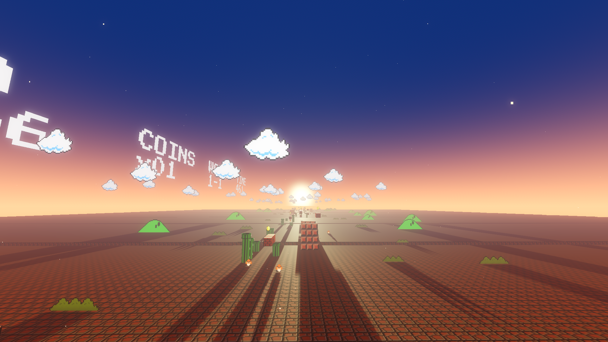
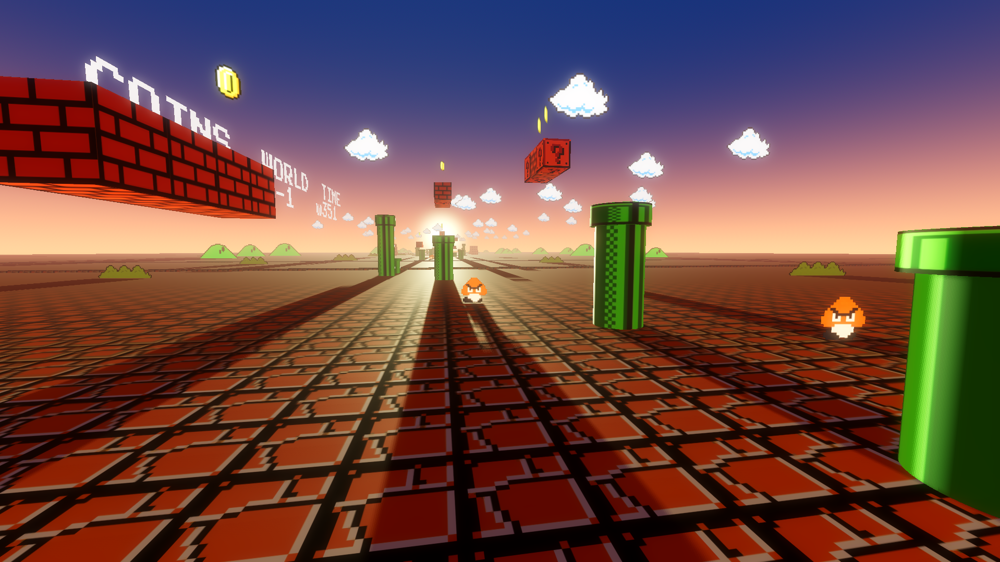

# Super Mario Sunset 🌅

A platformer tribute built with **Godot 4.3** and **C#**. This project explores the intersection of nostalgic gameplay and cinematic atmosphere, focusing on lighting, shaders, and a sense of solitude.

[Play the demo on itch.io](https://vardan-67.itch.io/super-mario-sunset-demo)

---

##  Overview
A technical platformer demo built to explore Godot 4.3 and C# integration. The project focuses on recreating classic Mario mechanics in a 3D environment with custom lighting and post-processing.

While the core mechanics—coins, enemies, and movement—remain faithful to the legacy, the environment tells a different story through deep shadows and golden-hour lighting.

##  Tech Stack & Features
As a **C# developer**, I focused on creating clean, modular code and leveraging modern engine features:

- **Engine:** Godot 4.3 (Mono/.NET version)
- **Language:** C#
- **Graphics:** Forward+ Renderer with custom environment settings.
- **Key Technical Highlights:**
  - **Cinematic Lighting:** Real-time sunset glow using Godot's WorldEnvironment and Bloom.
  - **Custom Shaders:** Visual effects inspired by old CRT monitors to evoke nostalgia.
  - **Hybrid 2.5D World:** A 3D environment populated with 2D pixel-art billboards.
  - **Modular Controller:** A responsive C# player controller handling 3D physics and 2D logic.

##  Gallery

  
  

##  Controls
- **WASD / Arrows:** Move
- **Space:** Jump
- **Shift:** Run
- **Esc:** Menu / Exit

##  Installation & Running
To explore the source code:
1. Ensure you have the **Godot 4.3 .NET version** installed.
2. Clone this repository: `git clone https://github.com/melqonyanaghvan/Super-Mario-Sunset.git`
3. Open `project.godot` in the editor.
4. Build the C# solution using MSBuild/Visual Studio.

---

### Developed by **Aghvan Melqonyan**

---
*Disclaimer: This is a non-commercial fan project. All rights to the Super Mario IP belong to Nintendo. This project is created for educational and artistic purposes only.*
